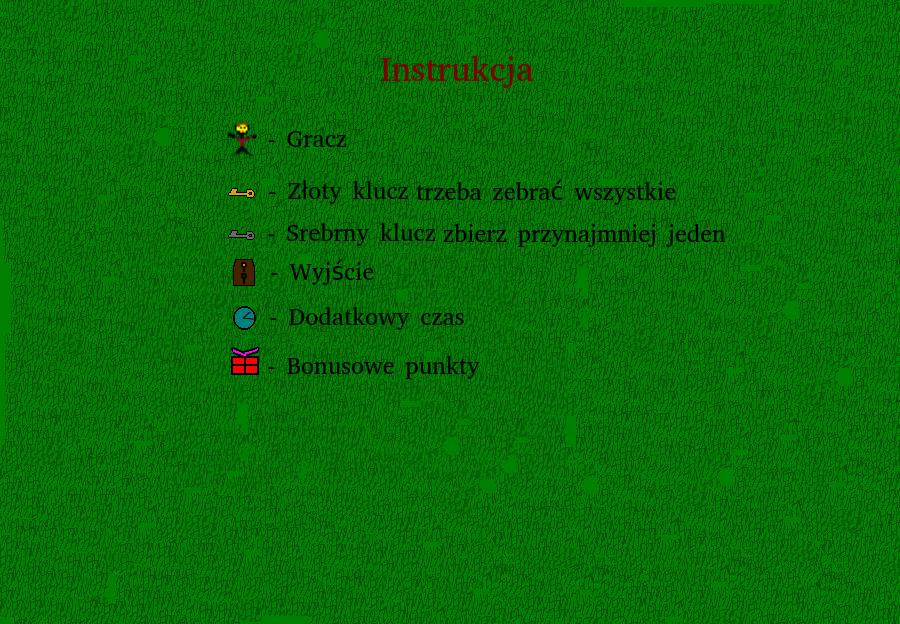

# Labirynt
<h2>Gra na laboratoria z Grafiki i komunikacji człowiek-komputer</h2>

Prosta gra Labirynt napisana w javie.
 

Twoim celem jest dojście do drzwi zanim skończy się czas. By otworzć drzwi trzeba zebrać złote klucze. Srebrne klucze potrzeba tylko jednego, a kolejne powiększają punkty na konjec mapy. Gra zapętla mapy aż do przegranej (gdy skończy się czas)

<h2>Tworzenje nowych map</h2>
W katologu resourses/mapyrówniesz szablon pokazujący obręby mapy.
Pierwsza linijka to czas levelu
W obrębie mapy można umieszczć odpowiednje litery by ją stworzyć. 
Legenda:
G - gracz (może być tylko jeden)
m - mury
z - Złoty klucz
s-  Srebrny klucz
B - bonusowe punkty
c- dodatkowy czas
W - wyjście
P - pułapka

W katalogu resourses/mapy znajduje się również plik listaleveli. By mapa pojawiła się w grze należy dopisać w nim jej nazwe.
